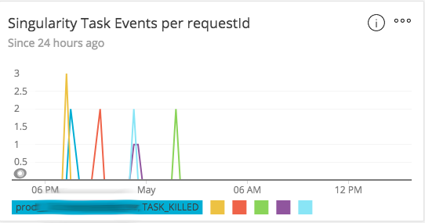

# Singularity Monitor

## Overview

[Singularity][1] is a Mesos Framework providing a REST API on top of [Apache
Mesos][2] project.

It acts as a `Container Scheduler` to run Apache Mesos tasks such as:
* long running service
* scheduled jobs
* on-demand and run once jobs

### Monitor

This project is written using Python in order to monitor the Tasks events of your [Singularity][1] cluster
and report them using [New Relic Insights][3] Data [API][4].

### How it works?

* Pulls frequently Tasks events from the Singularity REST [History API][5] every `PERIOD`
* Inserts custom event `SingularityTaskEvent` inside `New Relic Insights` data sources
* Uses New Relic Python agent to instrument application performance

### New Relic Insights Dashboard

Using [NewRelic Query Langage][6] (NRQL) you can build a chart on a dashboard from the data
source events using the following query:

```sql
SELECT uniqueCount(id) FROM SingularityTaskEvent where version = 1 facet requestId, lastTaskState SINCE 24 hours AGO TIMESERIES 15 minutes
```

This query display a chart of events for every `requestId` for last 24 hours ago such as below.



### Observability

This project was written to have a better observability in our scheduler workload
and report container faulty statuses.

When you have to deal with lot of containers running in production orchestrated on
several hosts, you want to be able to figure out if your scheduler has
successfully executed the request for your task on a arbitrary host.

The schedule of a Task might not be succeeded for multiple reasons such as
container resource allocation, configuration issue, network issue, exception
traceback, unavailable service dependency and more.

It helped us revealing some container failure patterns on some services.

## Build

You can use build script `build.sh` provided in order to generate a new image.

The script also upload to Docker registry in order to publish the image and
create a `latest` tag.

## Run

### Using Python

1. Create virtualenv

```
python3 -m sgmon-env /path/to/env/sgmon-env
source /path/to/env/sgmon-env/bin/activate
```

2. Install dependencies

Inside your virtual environment, install the required dependencies packages:

```shell
(sgmon-env) pip install -r requirements.txt --upgrade pip
```

3. Execute the program inside the virtual environment

```shell
export SINGULARITY_URL=http://env-singularity-server-fqdn/singularity
export NEWRELIC_ACCOUNT_ID=<redacted>
export NEWRELIC_INSIGHTS_KEY=<redacted>
export NEW_RELIC_LICENSE_KEY=<redacted>
$(which singularity-monitor)
```

### Using Docker

You can pass all the environment variables in the `vars` file and execute the following command line:

```shell
docker run -ti --env-file vars -p 8888:8888 gonitro/singularity-monitor:latest
```

On **Successful** execution, you should see the log lines showing the New Relic agent has started to report metrics

```
2019-11-14 16:13:06,779     INFO [    sgmon.nr] Agent start reporting data to New Relic APM
...
```

## Configuration

This run as a Singularity service using a Docker container with a Python 3.7
runtime on [Alpine Linux][7].

### Required Env Vars

If you are running it in the Docker container, you may configure it with
environment variables:

* `PERIOD`: Period for pulling events (in seconds)
* `SINGULARITY_URL`: URL of your Singularity cluster
* `NEWRELIC_ACCOUNT_ID`: New Relic Account Id
* `NEWRELIC_INSIGHTS_KEY`: New Relic Insights API key
* `NEW_RELIC_LICENSE_KEY`: New Relic Agent license key
* `NEW_RELIC_APP_NAME`: New Relic application name reported
* `NEW_RELIC_ENVIRONMENT`: New Relic application environment

## Limitations

It reports the following Task States:
* `TASK_KILLED`
* `TASK_ERROR`
* `TASK_LOST`
* `TASK_FAILED`

This [Mesos Task State][8] link explains the existing Task States.

## Contributing

Contributions are more than welcome. Bug reports with specific reproduction
steps are great. If you have a code contribution you'd like to make, open a
pull request with suggested code.

Ping us to let us know you're working on it by opening a GitHub Issue on the
project.

## License

This project is released under MIT license.

Copyright (c) 2018 Nitro Software

[1]: http://getsingularity.com
[2]: https://mesos.apache.org
[3]: https://docs.newrelic.com/docs/insights
[4]: https://docs.newrelic.com/docs/insights/insights-data-sources/custom-data/insert-custom-events-insights-api
[5]: http://getsingularity.com/Docs/reference/apidocs/api-history.html
[6]: https://docs.newrelic.com/docs/insights/nrql-new-relic-query-language
[7]: https://alpinelinux.org
[8]: https://mesos.apache.org/documentation/latest/task-state-reasons
